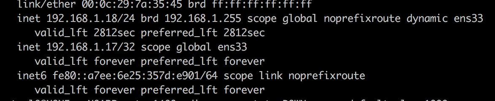
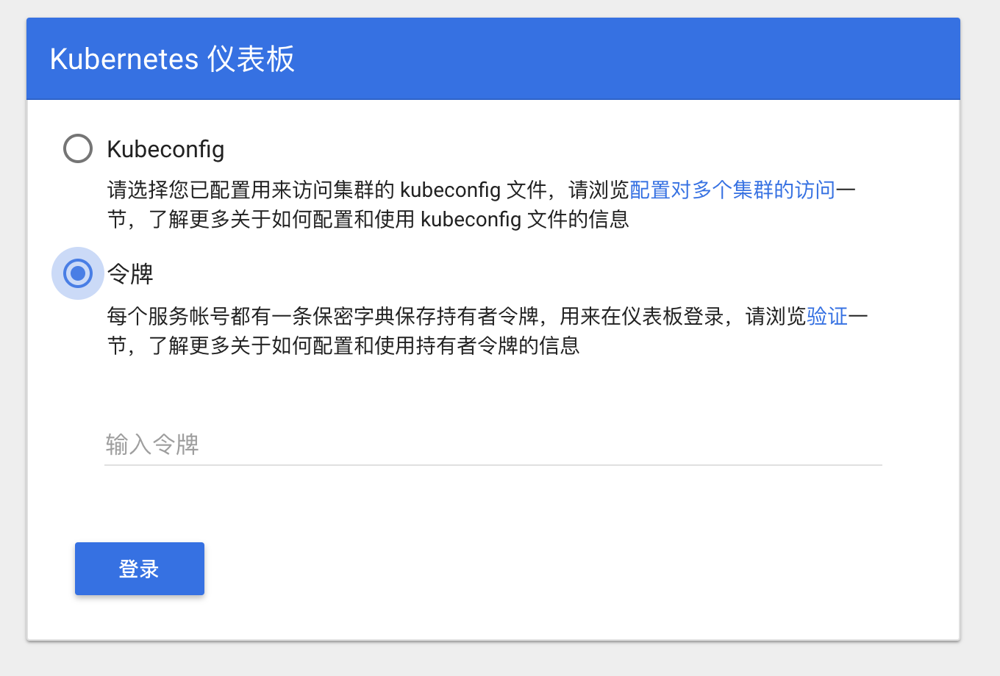

搭建k8s环境网上有很多的教程，但大多数都是一kubeadm或者二进制的为主，使用kubeadm部署就需要科学上网，这可能就拦了不少人；而使用二进制部署又十分的麻烦。这两天在看github的项目发现了一个适用于生产环境的HA一键部署K8s，强力推荐给大家：[kubeasz](https://github.com/gjmzj/kubeasz)。

其实官网上已经有很详细的教程，但我在这还是记录一下搭建（All In One）本机测试环境的一些步骤，还有一些问题。

我是用的macos系统，内存16g，并创建了5个虚拟机，每个虚拟机内存2g，硬盘大小20g，使用centos minimal系统，网络与本机桥接。其中：
* 3台master（master高可用，不想实现的话一台就够）
* 2台node（担心内存不够，只搭建了2个node）

如果使用ubuntu系统的话，请直接看官方教程，其实也就是安装相关工具命令不同。

#### 基础环境安装准备
``` bash
# 文档中脚本默认均以root用户执行
# 安装 epel 源
yum install epel-release -y

# 安装依赖工具
yum install git python python-pip -y

# 安装ansible (国内如果安装太慢可以直接用pip阿里云加速)
#pip install pip --upgrade
#pip install ansible
pip install pip --upgrade -i http://mirrors.aliyun.com/pypi/simple/ --trusted-host mirrors.aliyun.com
pip install --no-cache-dir ansible -i http://mirrors.aliyun.com/pypi/simple/ --trusted-host mirrors.aliyun.com

# 配置ansible ssh密钥登陆
ssh-keygen -t rsa -b 2048 回车 回车 回车

#将本机的公钥复制到远程机器，$IP为本虚机地址，按照提示输入yes 和root密码
ssh-copy-id $IP 
```

#### 修改节点IP（可选）
由于开始节点IP分配使用dhcp，所以换了一个网络就变了，直接影响k8s网络环境，所以在这直接修改为静态IP,每个节点都需要操作。
``` bash
TYPE="Ethernet"
PROXY_METHOD="none"
BROWSER_ONLY="no"
BOOTPROTO="static"
DEFROUTE="yes"
IPV4_FAILURE_FATAL="no"
IPV6INIT="yes"
IPV6_AUTOCONF="yes"
IPV6_DEFROUTE="yes"
IPV6_FAILURE_FATAL="no"
IPV6_ADDR_GEN_MODE="stable-privacy"
NAME="ens33"
UUID="64725492-08da-4533-bf0f-e04c3e7bb546"
DEVICE="ens33"
ONBOOT-"yes"
IPADDR="192.168.1.17"
NETMASK="255.255.255.0"
GATEWAY="192.168.1.1"
DNS1="114.114.114.114"
```

#### 安装kubernetes集群

- 下载项目源码

    ``` bash
    # 方式一：使用git clone
    git clone --depth=1 https://github.com/gjmzj/kubeasz.git
    mkdir -p /etc/ansible
    mv kubeasz/* /etc/ansible
    
    # 方式二：从发布页面下载源码解压到同样目录 https://github.com/gjmzj/kubeasz/releases 
    ```
- 下载二进制文件  
从分享的[百度云链接](https://pan.baidu.com/s/1c4RFaA)，下载解压到/etc/ansible/bin目录。我是下载到本机然后使用

    `scp -v Downloads/k8s.1-13-5.tar.gz root@192.168.1.17:/etc/ansible/`

    ``` bash
    tar zxvf k8s.1-13-5.tar.gz	# 以安装k8s v1.13.5为例
    mv bin/* /etc/ansible/bin
    ```
- 配置集群参数
  - 必要配置：`cd /etc/ansible && cp example/hosts.allinone.example hosts`, 然后实际情况修改此hosts文件
     ```
     # 集群部署节点：一般为运行ansible 脚本的节点
    # 变量 NTP_ENABLED (=yes/no) 设置集群是否安装 chrony 时间同步
    [deploy]
    192.168.1.20 NTP_ENABLED=no

    # etcd集群请提供如下NODE_NAME，注意etcd集群必须是1,3,5,7...奇数个节点
    [etcd]
    192.168.1.20 NODE_NAME=etcd1

    [kube-master]
    192.168.1.20

    [kube-node]
    192.168.1.21
    192.168.1.22

    # 参数 NEW_INSTALL：yes表示新建，no表示使用已有harbor服务器
    # 如果不使用域名，可以设置 HARBOR_DOMAIN=""
    [harbor]
    192.168.1.19 HARBOR_DOMAIN="" NEW_INSTALL=yes
    ...
     ```
     如果你的节点已经配置了npt，NTP_ENABLED值为yes，然后再修改deploy，master，node节点的ip，我需要配置harbor所以我还配置了一下harbor。
  - 修改roles/kube-master/defaults/main.yml中的basic_auth的密码,这个涉及到使用dashboard时需要验证登录。
      ```
      BASIC_AUTH_USER: 'admin'
    # 密码：初次运行时会生成随机密码
    BASIC_AUTH_PASS: '*****'
      ```
  - 验证ansible 安装：`ansible all -m ping` 正常能看到节点返回 SUCCESS

- 开始安装


    ``` bash
    # 分步安装
    ansible-playbook 01.prepare.yml
    ansible-playbook 02.etcd.yml
    ansible-playbook 03.docker.yml
    ansible-playbook 04.kube-master.yml
    ansible-playbook 05.kube-node.yml
    ansible-playbook 06.network.yml
    ansible-playbook 07.cluster-addon.yml 
    # 一步安装
    #ansible-playbook 90.setup.yml
    ```
    在这里遇到一个问题，执行完01.prepare.yml后，有一台虚拟机网络就有问题了，这个问题应该和我创建虚拟机时网络有关，只有执行`systemctl restart network`后就好了。
    

#### 验证安装
如果提示kubectl: command not found，退出重新ssh登陆一下，环境变量生效即可
``` bash
kubectl version
kubectl get componentstatus # 可以看到scheduler/controller-manager/etcd等组件 Healthy
kubectl cluster-info # 可以看到kubernetes master(apiserver)组件 running
kubectl get node # 可以看到单 node Ready状态
kubectl get pod --all-namespaces # 可以查看所有集群pod状态，默认已安装网络插件、coredns、metrics-server等
kubectl get svc --all-namespaces # 可以查看所有集群服务状态
```
#### 安装主要组件

``` bash
# 安装kubedns，默认已集成安装
#kubectl create -f /etc/ansible/manifests/kubedns
# 安装dashboard，默认已集成安装
#kubectl create -f /etc/ansible/manifests/dashboard
```
这里项目已经帮忙安装好了dashboard，所以直接进行验证
``` bash
# 查看pod 运行状态
kubectl get pod -n kube-system | grep dashboard
kubernetes-dashboard-76479d66bb-nc9fc   1/1     Running   0          2m40s
# 查看dashboard service
kubectl get svc -n kube-system|grep dashboard
kubernetes-dashboard   NodePort    10.68.106.134   <none>        443:24220/TCP            3m1s
# 查看集群服务
kubectl cluster-info|grep dashboard
kubernetes-dashboard is running at https://192.168.1.17:8443/api/v1/namespaces/kube-system/services/https:kubernetes-dashboard:/proxy
# 查看pod 运行日志，关注有没有错误
kubectl logs kubernetes-dashboard-86bd8778bf-w4974 -n kube-system
```
验证无误后使用上面查询到的https://192.168.1.17:8443/api/v1/namespaces/kube-system/services/https:kubernetes-dashboard:/proxy这个网址，登录到dashboard。

这里需要注意！！！kubeasz 1.0.0 版本以后默认关闭 basic-auth，可以在 roles/kube-master/defaults/main.yml 选择开启或者使用
`easzctl basic-auth -s`命令开启。否则将显示
```
{
  "kind": "Status",
  "apiVersion": "v1",
  "metadata": {
    
  },
  "status": "Failure",
  "message": "Unauthorized",
  "reason": "Unauthorized",
  "code": 401
}
```
然后在弹出的对话框输入roles/kube-master/defaults/main.yml填写的账号密码,会需要输入多次，然后来到这个界面，选择令牌登录，在控制台输入`kubectl -n kube-system describe secret $(kubectl -n kube-system get secret | grep admin-user | awk '{print $1}')`来获取Token.




#### 清理集群

如果是彻底奔溃了，可以清理集群后重新创建。

``` bash
ansible-playbook 99.clean.yml
```

如果出现清理失败，类似报错：`... Device or resource busy: '/var/run/docker/netns/xxxxxxxxxx'`，需要手动umount该目录后清理

``` bash
$ umount /var/run/docker/netns/xxxxxxxxxx
$ rm -rf /var/run/docker/netns/xxxxxxxxxx
```

#### 结语
k8s基本环境就已经全部搭建好，尽情的享受吧。后面也会有k8s上搭建持久化存储，k8s上搭建prometheus，k8s搭建日志系统，以及搭建istio等等。我也会努力的学习将知识运用到实践之中。